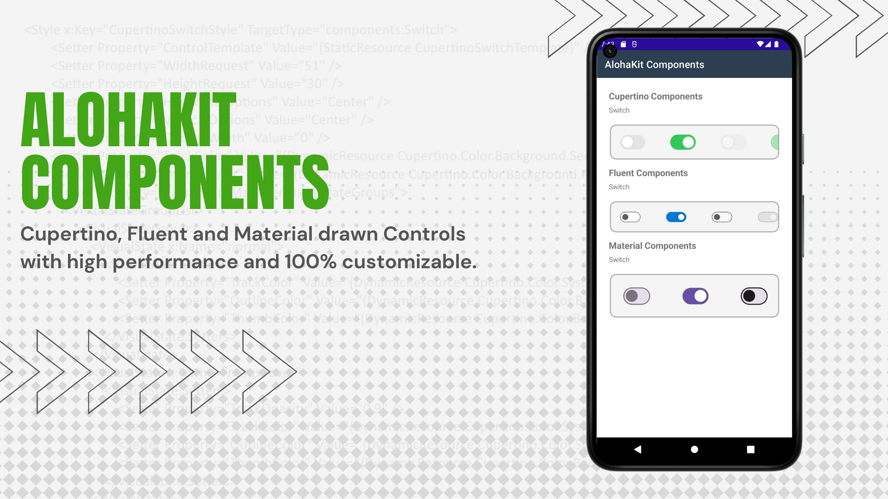
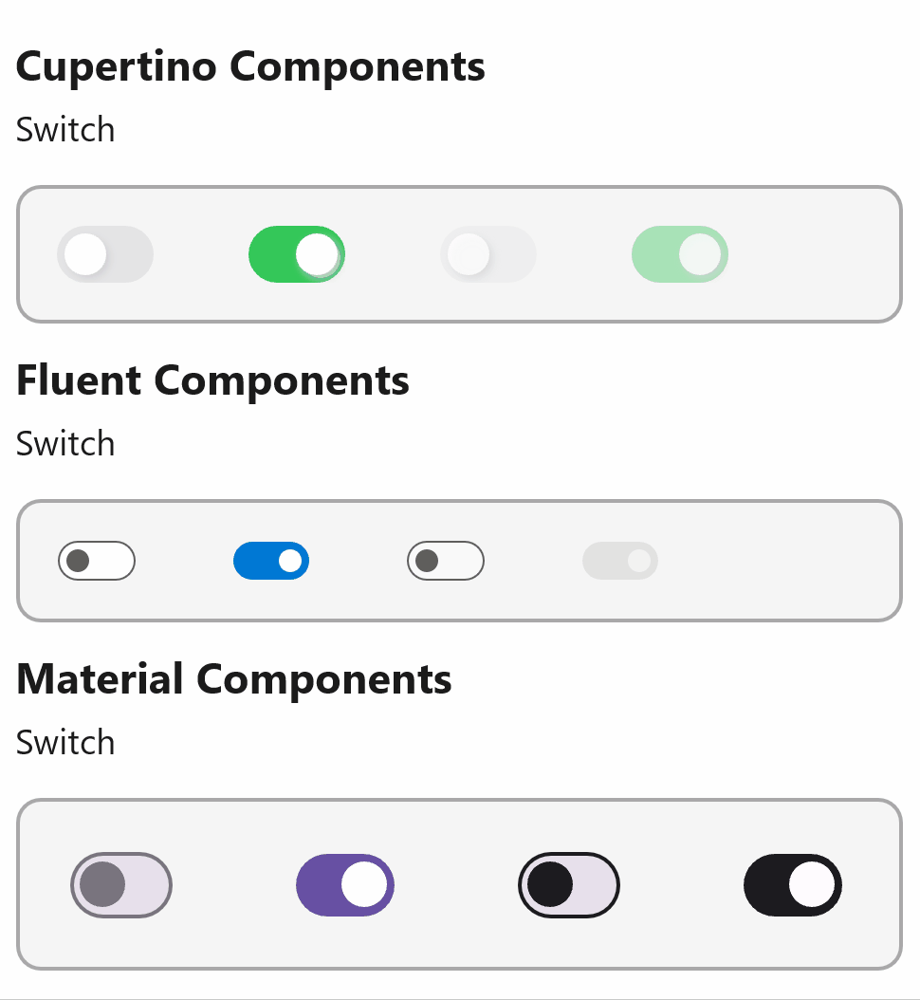

# AlohaKit.Components

Cupertino, Fluent and Material drawn Controls with high performance and 100% customizable.



At the moment, this is _"just"_ an experimental library where try to optimize, evolve and cover the gaps of [Microsoft.Maui.Graphics.Controls](https://github.com/dotnet/Microsoft.Maui.Graphics.Controls). There are performance improvements, visual state management, drawing more effects and animations, more ways to extend both XAML and C#, etc. Of course, any idea, improvement, optimization or detail of this library can end up benefiting Microsoft.Maui.Graphics.Controls.

## Features

**Pixel perfect**

Same appearance and behavior on all platforms.

This includes the appearance to all possible control states, mouse over, pressed, disabled, etc.



**High performance**

Controls drawn using Microsoft.Maui.Graphics always looking for maximum optimization.

**Highly customizable**

It is extremely easy to go from having a component using Fluent Design to Material.

```
<Switch Visual="Cupertino" />

<Switch Visual="Fluent" />

<Switch Visual="Material" />
```

What happens in a .NET MAUI control, for example using the Switch, if you want to modify the Thumb to have a star shape with a shadow in addition to displaying the value in a text? You can modify many colors using Styles, modify the Track, the Thumb or you can even change the Thumb to an image. However, if you want to display a text, or make more complex modifications, you will need to either create a composition of cross platform controls to achieve the result or go to the native platform. The first option is simple, it only requires knowing the .NET MAUI APIs but it increases the visual hierarchy and has an impact on performance. The second option allows us to take advantage of the native platform better, probably more optimized although it requires more code per platform and knowledge about each native platform.

What if we could customize anything from the abstraction layer, with C# or XAML, and without penalizing performance?

Among the possibilities to customize we have the use of ControlTemplates just like we have in various Microsoft frameworks.

```
<ControlTemplate x:Key="MySwitchTemplate">
    <alohakit:CanvasView
        x:Name="Part_Canvas"
        HeightRequest="{TemplateBinding HeightRequest}"
        WidthRequest="{TemplateBinding WidthRequest}">
        <!-- TRACK -->
        <alohakit:RoundRectangle
            x:Name="Part_Track"
            HeightRequest="30"
            WidthRequest="51"
            Opacity="{TemplateBinding TrackOpacity}"
            Fill="{TemplateBinding TrackColor}" />
        <!-- THUMB -->
        <alohakit:Ellipse
            x:Name="Part_Thumb"
            X="4"
            Y="4"
            WidthRequest="22"
            HeightRequest="22"
            Opacity="{TemplateBinding ThumbOpacity}"
            Stroke="{TemplateBinding OutlineColor}"
            StrokeThickness="{Binding OutlineWidth}"
            Fill="{TemplateBinding ThumbColor}">
            <alohakit:RoundRectangle.Shadow>
                <alohakit:Shadow
                    Offset="2, 2"
                    Radius="6"
                    Color="LightGray"/>
            </alohakit:RoundRectangle.Shadow>
        </alohakit:RoundRectangle>
    </alohakit:CanvasView>
</ControlTemplate>
```

```
<Switch ControlTemplate="{StaticResource MySwitchTemplate}" />
```

In addition to being able to modify any property, color or size, you can access the definition of the control and modify, add or remove what you need. All components have a **ControlTemplate** property. Remember, everything is drawn.

**A11y Support**

(Work in progress)

**RTL Support**

(Work in progress)

## Copyright and license

Code released under the [MIT license](https://opensource.org/licenses/MIT).
